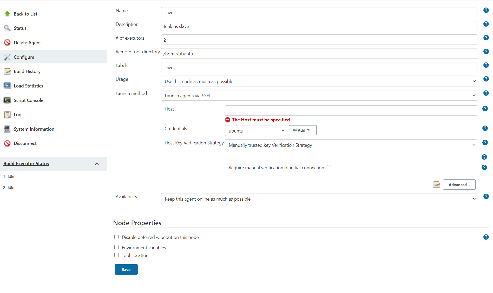

# Jenkins-use-AWS
We take the Historical-document-layout-analysis as an example to demonstrate how to deploy this project to AWS through jenkins. We will create two EC2 instances, one for management and the other for running our project. The project is triggered by GitHub webhook. When the project is pushed any commit, Jenkins will automatically build the project.

## Requirement
In order to complete the deployment, you need some basic knowledge about AWS and an AWS account. We will create two EC2 instances, one is Jenkins manager and another is Jenkins slave. Our project will run in Jenkins slave. The minimum requirements for these two instances are as follows:
1. Jenkins manager can use any free instance. We use t2.micro instance with Amazon Linux 2 AMI (HVM) (the default choice when you create EC2).

2. Jenkins slave need at least 4GB of RAM and 12GB of storage. In this project, we use t2.medium and bind a 16GB volume, with Ubuntu 20.04. We do not recommend using Amazon Linux or CentOS because there may be problems with docker adaptation.

## Security groups
For Jenkins manager and Jenkins slave, we configure two security groups respectively.
1. For Jenkins manager, we should add a Custom TCP rule in inbound rules, select port 8080, in the source, enter the IP address of the host (the local computer you are using to connect AWS). If you don't know the IP address, enter "what is my IP address" in any browser. This rule will open port 8080 for your host. Port 8080 is the default configuration page of Jenkins. 
In addition, you also need to add 3 similar rules to open 8080 for GitHub's webhook. In these 3 rules, change the source to the [IP address of GitHub hook](http://www.runoob.com/). 

<b>Note</b>: You can also set source to 0.0.0.0/0 here. But we do not recommend this because it will make your Jenkins manager open to everyone. 

2. For Jenkins slave we only need to add a single rule which is open port 5000. This is because our project needs to use this port. If you deploy another project, then this rule will be determined according to your project. Set source to 0.0.0.0/0, than anyone can visit this project.

In addition, the security group has a default rule, which is to open port 22. This is the port we connect to AWS instances, so do not close this port.

## Configure Jenkins manager
In AWS EC2 console, select jenkins manager instance. In the upper right corner click "connect" you will find several ways to connect instance. After connecting to this instance, we need to install jenkins on this instance. jenkins is based on Java, so we should install Java first.   

`	sudo yum install java -y`  

Now download jenkins repo:  

`sudo wget -O /etc/yum.repos.d/jenkins.repo https://pkg.jenkins.io/redhat-stable/jenkins.repo` 
`sudo rpm --import https://pkg.jenkins.io/redhat-stable/jenkins.io.key`  

You can choose the corresponding [Jenkins version](https://pkg.jenkins.io/) according to the OS. We use the redhat-stable jenkins repo for our system, if you using the Amazon Linux you can use this jenkins version as well.
Install jenkins and start the service:  

`sudo yum install jenkins`
`sudo service jenkins start`  

Use `systemctl status jenkins` to check the status of jenkins. If jenkins is running, open the browser and enter: <Public IPv4 address for jenkins manager instance>:8080 to enter the jenkins configuration page. The Public IPv4 address you can find in AWS EC2 console. Now you enter the jenkins configuration webpage, you need to enter the password to unlock it. You can use `sudo cat ...` command to get the password. Here we install the default plugin which will contain the git plugins we need. 

## Configure jenkins slave
We use Ubuntu 20.04 instead of the same operating system as jenkins manager (Amazon Linux). Because Amazon Linux has encountered some problems in docker, you should choose OS system based on your project.  
This instance is used to deploy our project, so there is no need to install jenkins. But in order to manage use jenkins manager, we need to install Java.   

`sudo apt-get install openjdk-11-jdk`  
The Java version should be the same as the jenkins manager.   

After that, [install docker](https://docs.docker.com/engine/install/ubuntu/) and [docker-compose](https://docs.docker.com/compose/install/).      
Now, we done everything in this instance.

## Add jenkins slave in jenkins manager
Open the webpage of jenkins manager, select Manage Jenkins -> Manage Nodes and clouds -> New Node. Enter the node name and select Permanent Agent. You will find the configuration page like follow：  

 

Here is an explanation of some parameters:  
Remote root directory is the root directory of jenkins slave instance. You can find it in the EC2 console. Different OS will have different root directories.  
When you create a jenkins project, you need to select the node to deploy through labels.  
In the launch method, select Launch agents via SSH, and then enter the Public IPV4 address of the slave instance in the Host. In the Credentials part, select private key, and then enter the key used to connect to the EC2 instance. This key is a pem file saved in your local machine.  

Click save and you will find this new node on the jenkins node page after a while. If adding a node fails, right-click the node, and then check the log to find the reason.

## Connect to GitHub via webhook
When some commit is pushed to GitHub, jenkins will automatically build a new project. To achieve this, we need to use webhook. 
1. In Manage Jenkins -> Configure Jenkins -> GitHub -> Advanced -> Override Hook URL. Copy this URL, if you cannot find GitHub, than you should install Github in plugin.
2. In your GitHub -> Setting -> Webhooks -> add webhook -> playload URL. Paste the URL.  

Note: Don't forget add the GitHub's IP in your jenkins manager security group, otherwise jenkins may not receive the webhook.  

## Run project in slave node
In jenkins, New Item -> (give a name) Freestyle. Then you will enter the configuration page, configure as follows:  
1. Restrict where this project can be run, use the label of your jenkins slave node.
2. Source Code Management -> Git. Give the Repository URL and credentials, you can [fork our project](https://github.com/Jambo-sudo/Historical-document-layout-analysis) or use your own project. 
3. Branches to build. Use 'main' or just leave it empty because we only have one branch. 
4. Build Triggers -> GitHub hook trigger for GITScm polling.
5. Build -> Execute shells. Use the follow shell script:  

`chmod +x ./build.sh`
`sudo ./build.sh`

You can find the details of build.sh in the [project](https://github.com/Jambo-sudo/Historical-document-layout-analysis).  

Now everything is ready! You can commit any changes to this GitHub, or click build now. Jenkins will automatically build this project and deploy it to the slave node. Then enter <Public IPv4 address for jenkins slave instance>:5000 in any browser, you will find the start page of this project. If you configure the security group according to our recommendations, then this website is open to the public now. You can invite your family and friends to visit this website. But this website can only be used for testing. Jenkins slave only has 4G memory, which is not enough to handle large input. We also do not have any backup and load balancing to deal with large-scale access.

